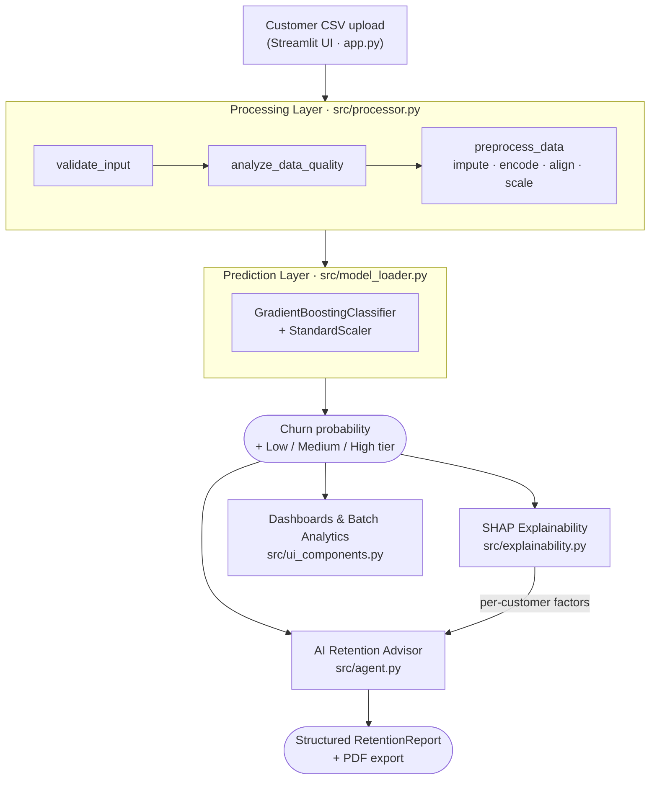
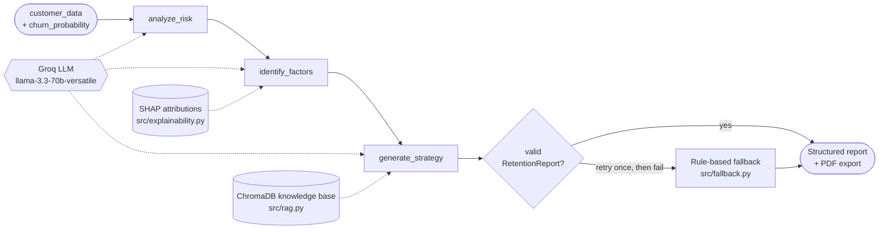

# ChurnGuard AI — Enterprise Customer Retention Platform

ChurnGuard AI is an end-to-end customer churn analytics platform for the
telecommunications industry. It combines a supervised machine learning model,
per-customer explainability, a retrieval-augmented LLM agent, and an interactive
Streamlit dashboard to not only predict which customers are likely to churn, but
to explain *why* and recommend concrete, grounded retention strategies.

The platform spans the full lifecycle: a reproducible ML pipeline (cleaning,
training, model selection, and evaluation) feeds a production inference service,
which is layered with SHAP explainability, a knowledge-base RAG retrieval layer,
a LangGraph agent backed by an LLM, and exportable PDF retention reports — all
delivered through a single interactive dashboard.

---

## Table of Contents

1. [Key Capabilities](#key-capabilities)
2. [System Architecture](#system-architecture)
3. [Machine Learning Pipeline](#machine-learning-pipeline)
4. [Model Performance](#model-performance)
5. [Explainability (SHAP)](#explainability-shap)
6. [Retrieval-Augmented Generation](#retrieval-augmented-generation)
7. [AI Retention Agent](#ai-retention-agent)
8. [Dashboard Walkthrough](#dashboard-walkthrough)
9. [Project Structure](#project-structure)
10. [Tech Stack](#tech-stack)
11. [Local Setup](#local-setup)
12. [Configuration — Groq API Key](#configuration--groq-api-key)
13. [Running the Application](#running-the-application)
14. [Deployment on Streamlit Community Cloud](#deployment-on-streamlit-community-cloud)
15. [Notebooks](#notebooks)
16. [Testing](#testing)
17. [Responsible AI Notes](#responsible-ai-notes)

---

## Key Capabilities

- **Churn prediction** — batch scoring of an uploaded customer CSV with
  per-customer churn probability and a Low / Medium / High risk tier.
- **Data quality gate** — schema validation, missing-value imputation, and
  IQR-based outlier detection with a 0–100 quality score before any prediction.
- **Global drivers** — model-level feature importance and portfolio analytics
  (tenure curves, churn distribution, high-risk segments).
- **Per-customer explainability** — SHAP attributions that quantify how each
  feature pushed an individual prediction toward or away from churn.
- **AI Retention Advisor** — a multi-step LLM agent that classifies risk,
  identifies contributing factors (grounded in SHAP), retrieves relevant
  playbook context, and produces a structured, actionable retention strategy.
- **Graceful degradation** — deterministic rule-based fallback when the LLM or
  RAG dependencies are unavailable, so the dashboard never breaks.
- **PDF export** — one-click, shareable retention reports for stakeholders.

---

## System Architecture



The prediction core is wrapped by three independent consumers — interactive
dashboards, SHAP explainability, and the AI Retention Advisor — that all read
from the same scored output.

---

## Machine Learning Pipeline

The supervised pipeline transforms raw Telco customer records into a calibrated
churn probability.

**Dataset.** Telco Customer Churn (Kaggle) — 7,043 customers, 21 original
features spanning demographics, subscribed services, contract type, and billing.
Target: `Churn` (Yes / No).

**Preprocessing** (`notebooks/preprocessing.ipynb`, mirrored at inference time in
`src/processor.py`):

1. Drop the non-predictive `customerID` identifier.
2. Coerce `TotalCharges` to numeric (blank strings become `NaN`).
3. Impute missing values — median for numeric columns, mode for categorical.
4. One-hot encode all categorical features.
5. Align the encoded frame to the exact training feature set (missing dummy
   columns are added as zeros), guaranteeing a stable input schema.
6. Standardise numeric features with `StandardScaler`.
7. Split 80 / 20 into training and test sets.

**Class imbalance.** Churners are the minority class, so SMOTE oversampling is
applied to the training fold to improve recall on the positive (churn) class.

**Model selection** (`notebooks/model_comparison.ipynb`). Three classifiers are
trained and compared — Logistic Regression, Random Forest, and Gradient
Boosting. The model with the highest F1 score is selected and persisted as the
production artifact. **Gradient Boosting** was chosen.

At inference time the app loads the persisted artifacts (`models/model.pkl`,
`models/scaler.pkl`, `models/feature_names.pkl`) and applies the identical
transform-then-predict path used during training.

---

## Model Performance

Evaluation on the held-out 20% test set.

### Model comparison

| Model                | Accuracy | Precision | Recall | F1     | ROC-AUC |
|----------------------|---------:|----------:|-------:|-------:|--------:|
| Logistic Regression  | 75.59%   | 52.45%    | 83.38% | 64.39% | 0.861   |
| Random Forest        | 79.13%   | 60.53%    | 60.86% | 60.70% | 0.837   |
| **Gradient Boosting (selected)** | **79.77%** | **59.52%** | **73.73%** | **65.87%** | **0.860** |

Gradient Boosting offers the best F1 — the strongest balance of precision and
recall — while keeping recall high. In a churn context recall is critical: a
missed churner is lost revenue, so the model is deliberately tuned to catch a
large share of true churners.

### Selected model — confusion matrix (test set)

|                 | Predicted: No | Predicted: Yes |
|-----------------|--------------:|---------------:|
| **Actual: No**  | 849           | 187            |
| **Actual: Yes** | 98            | 275            |

Evaluation figures are reproducible via `python generate_figs.py`, which writes
`figures/churn_distribution.png`, `figures/confusion_matrices.png`, and
`figures/roc_curves.png`.

---

## Explainability (SHAP)

Global feature importance answers "what drives churn across the portfolio";
SHAP answers "why was *this* customer flagged".

`src/explainability.py` builds a SHAP explainer matched to the model type
(`LinearExplainer` for linear models, `TreeExplainer` for tree ensembles,
`KernelExplainer` as a fallback) and returns the top-k contributing features for
a single customer, each annotated with its value, signed SHAP contribution, and
a plain-language direction ("increases churn risk" / "decreases churn risk").

These per-customer attributions are surfaced in the dashboard and, importantly,
are fed into the retention agent so the LLM's reasoning is grounded in the
model's actual decision rather than generic assumptions.

---

## Retrieval-Augmented Generation

`src/rag.py` implements a lightweight RAG layer over a curated retention
knowledge base (`data/knowledge_base/*.md`: customer lifecycle, pricing
optimization, telecom strategies).

- Documents are chunked and embedded with the `all-MiniLM-L6-v2`
  sentence-transformer.
- Embeddings are persisted in a local ChromaDB store (`data/chromadb/`), so the
  index is built once and reused across runs.
- At strategy time the agent issues a semantic query built from the customer's
  risk level, contributing factors, and profile, and retrieves the top-k most
  relevant playbook passages to ground the recommendation.

The layer degrades gracefully: if ChromaDB or the embedding model are not
installed, retrieval returns empty and the agent continues without RAG context.

---

## AI Retention Agent



The retention strategy is produced by a LangGraph state machine
(`src/agent.py`) that runs three nodes in sequence:

1. **analyze_risk** — classifies the churn probability into Low / Medium / High.
   The LLM output is validated and falls back to deterministic thresholds if it
   drifts.
2. **identify_factors** — extracts the 3–5 strongest churn drivers from the
   customer profile, preferring the SHAP-attributed features so the explanation
   reflects the model's actual decision.
3. **generate_strategy** — retrieves relevant knowledge-base context (RAG) and
   produces a concrete, prioritised retention plan.

The final output is validated against a strict Pydantic schema
(`RetentionReport` in `src/models.py`) containing the risk summary, risk level,
churn probability, contributing factors, prioritised recommended actions
(action / rationale / priority), supporting sources, and disclaimers. Invalid
JSON triggers a single automatic retry.

**LLM provider.** `src/llm_client.py` wraps the Groq API
(`llama-3.3-70b-versatile`) with exponential-backoff retries.

**Resilience.** If the LLM is unavailable after retries, `src/fallback.py`
produces a deterministic, rule-based strategy using well-established telecom
churn heuristics — so the advisor always returns a valid, actionable report.

**Export.** `src/pdf_export.py` renders the structured report into a formatted,
shareable PDF.

---

## Dashboard Walkthrough

The Streamlit app (`app.py`) exposes the platform through six tabs:

1. **Executive Dashboard** — KPI cards (total customers, predicted churn rate,
   high-risk count, average probability), churn distribution, and tenure-vs-risk
   analysis.
2. **Risk Analysis** — global churn drivers and a ranked table of the most
   vulnerable customers.
3. **AI Retention Advisor** — select an at-risk customer to generate a SHAP-
   grounded, LLM-authored retention strategy, then export it as a PDF.
4. **Batch Analytics** — portfolio-level churn analytics across the upload.
5. **Model Performance** — held-out test metrics and confusion matrix.
6. **Raw Data Explorer** — the enriched, scored dataset with CSV download.

The workflow: upload a Telco-format CSV → automatic validation and quality
scoring → batch prediction → explore portfolio insights → drill into individual
at-risk customers for an AI-generated, exportable retention plan.

---

## Project Structure

```
churn-detection/
├── app.py                       # Streamlit application (entry point)
├── generate_figs.py             # Reproduces evaluation figures
├── requirements.txt
├── .streamlit/
│   ├── config.toml              # Theme
│   └── secrets.toml.example     # Template for the Groq API key
├── data/
│   ├── telco.csv                # Raw dataset
│   ├── knowledge_base/          # RAG source documents (markdown)
│   └── chromadb/                # Persisted vector store
├── models/
│   ├── model.pkl                # Production model (Gradient Boosting)
│   ├── best_model.pkl           # Selected model artifact
│   ├── scaler.pkl               # Fitted StandardScaler
│   ├── feature_names.pkl        # Training feature order
│   ├── metrics.json             # Selected-model test metrics
│   └── comparison.json          # Per-model comparison metrics
├── notebooks/
│   ├── preprocessing.ipynb
│   ├── model_training.ipynb
│   ├── model_comparison.ipynb
│   └── feature_importance.ipynb
├── src/
│   ├── model_loader.py          # Cached loaders for model/scaler/features
│   ├── processor.py             # Validation, quality checks, preprocessing
│   ├── ui_components.py         # Dashboard charts and panels
│   ├── explainability.py        # SHAP attributions
│   ├── rag.py                   # ChromaDB knowledge-base retrieval
│   ├── llm_client.py            # Groq API wrapper
│   ├── prompts.py               # Prompt templates
│   ├── models.py                # Pydantic RetentionReport schema
│   ├── agent.py                 # LangGraph retention agent
│   ├── fallback.py              # Rule-based fallback strategy
│   └── pdf_export.py            # PDF report generation
├── figures/                     # Generated evaluation plots
├── report/                      # LaTeX technical reports
└── tests/
    └── test_rag.py
```

---

## Tech Stack

- **Language:** Python
- **ML:** scikit-learn, imbalanced-learn (SMOTE), SHAP
- **Data:** pandas, NumPy
- **LLM / Agent:** Groq (`llama-3.3-70b-versatile`), LangGraph, LangChain Core,
  Pydantic
- **RAG:** ChromaDB, sentence-transformers (`all-MiniLM-L6-v2`)
- **UI / Viz:** Streamlit, Altair, Matplotlib, Seaborn
- **Reporting:** fpdf2

---

## Local Setup

```bash
git clone https://github.com/kunal-10-cloud/Churn-Rentention.git
cd Churn-Rentention

python -m venv venv
source venv/bin/activate        # Windows: venv\Scripts\activate

pip install -r requirements.txt
```

---

## Configuration — Groq API Key

The AI Retention Advisor calls the Groq API and requires an API key
(create one at https://console.groq.com/keys). The key is resolved in this
order (see `src/llm_client.py`):

1. The `GROQ_API_KEY` environment variable (or a local `.env` file).
2. `st.secrets["GROQ_API_KEY"]` (Streamlit secrets).

If no key is configured, prediction and analytics still work fully; only the
LLM-authored strategy falls back to the deterministic rule-based engine.

**Option A — `.env` file (local):**

```bash
echo 'GROQ_API_KEY=gsk_your_real_key_here' > .env
```

**Option B — Streamlit secrets (local):**

```bash
cp .streamlit/secrets.toml.example .streamlit/secrets.toml
# then edit .streamlit/secrets.toml and set GROQ_API_KEY
```

Both `.env` and `.streamlit/secrets.toml` are gitignored and will not be
committed.

---

## Running the Application

```bash
streamlit run app.py
```

The app opens at `http://localhost:8501`. Upload a Telco-format CSV (the
included `data/telco.csv` works as a sample) to begin.

---

## Deployment on Streamlit Community Cloud

1. Push the repository to GitHub.
2. On https://share.streamlit.io, create a new app pointing at `app.py`.
3. Open **App settings → Secrets** and add the key in TOML format — do **not**
   commit a real `secrets.toml`:

   ```toml
   GROQ_API_KEY = "gsk_your_real_key_here"
   ```

4. Save. The app reboots and reads the key via `st.secrets`.

**Resource note.** `chromadb`, `sentence-transformers`, and `shap` pull in heavy
dependencies (including PyTorch) and may approach the memory limits of the free
Community Cloud tier. The RAG and SHAP layers are designed to degrade
gracefully, so if you hit resource constraints you can trim those dependencies
and the core prediction and advisor flows continue to operate.

---

## Notebooks

| Notebook | Purpose |
|----------|---------|
| `preprocessing.ipynb`      | Data cleaning, encoding, scaling, train/test split |
| `model_training.ipynb`     | Train the baseline model and persist artifacts |
| `model_comparison.ipynb`   | Compare three classifiers and select the best by F1 |
| `feature_importance.ipynb` | Extract global feature importance and business insights |

---

## Testing

A smoke test exercises the RAG index build and retrieval path:

```bash
python -m tests.test_rag
```

---

## Responsible AI Notes

- All AI-generated retention strategies are advisory and include explicit
  disclaimers; they are intended for human review, not automated decisions that
  materially affect customers.
- The agent is constrained to ground recommendations in the supplied customer
  data and SHAP attributions, and to avoid inventing facts not present in the
  profile.
- The rule-based fallback ensures the system remains functional and transparent
  even without the LLM.
